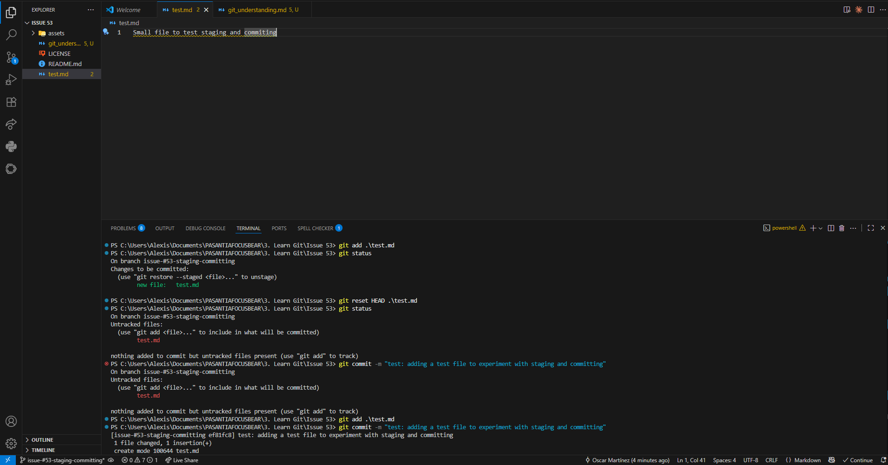

## REFLECTION

### What is the difference between staging and committing?

The difference between staging and committing is that staging is when you add some files that will later be committed. Staging is more flexible because you can remove or untrack a file, while once you commit, it’s not easy to change or delete it without disturbing the log history.

### Why does Git separate these two steps?

Git separates these two steps to improve file management and let you choose which files you want to include in your commit, avoiding possible mistakes during the workflow.

### When would you want to stage changes without committing?

I would stage my changes without committing them when I have already finished a task in one file but still have pending work in other files. In that case, I would use git add like a task checker to mark that file as ready for the main commit.

## EXPERIMENT

### TESTING STAGING AND COMMITTING FILES
