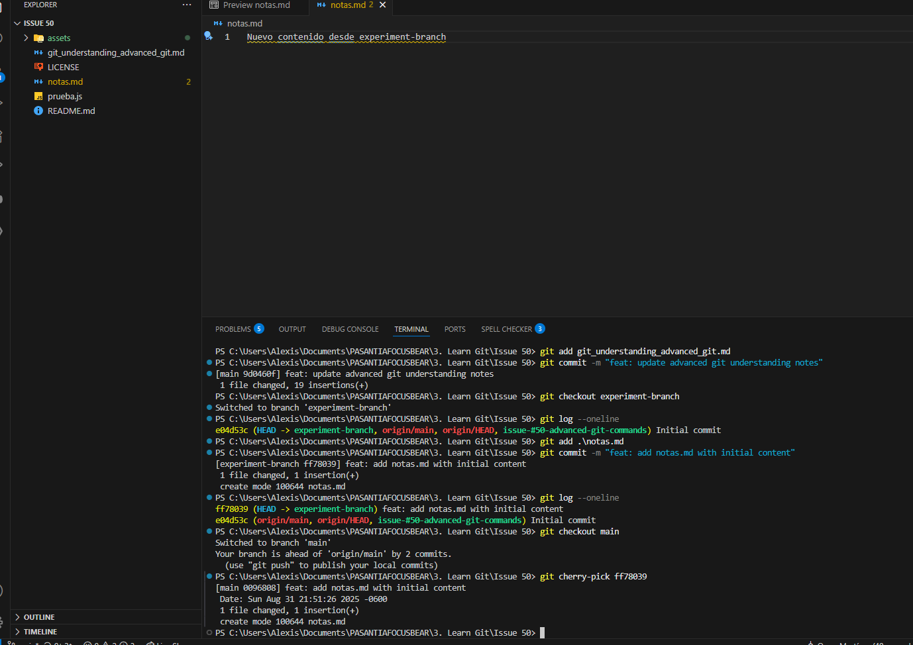

## REFLECTION

### What does each command do?

#### GIT CHECKOUT MAIN --(FILE)

This command replaces our current version of a file with the version from the branch main. It's used if we are writing a file on an alternative branch and we mess the file up, so we just bring back the original main file.

#### GIT CHERRY-PICK (COMMIT)

TThis command takes a commit from another branch and applies it on top of the current branch, it copies the exact changes made in that commit and creates a new commit with a different hash.

#### GIT LOG

This command shows the history of commits in our repository, each commit shows the commit hash, the author, the date, and the commit message. It's used to review commit history, or to find a commit hash if we want to use it to do a "git checkout" or a "git cherry-pick".

#### GIT BLAME (FILE)

This command shows who last modified each line of a file, along with the commit hash. It's useful to trace changes and find out when and why a specific line was introduced. Some useful variants of this command would be git blame -w (file), this option shows blame info but ignores whitespace changes.

### When would you use it in a real project?

I would use these commands on a real project to work with multiple teammates. For example, if I am working on some changes in a specific file but I'm not satisfied with my work, I would apply a git checkout main to return the file to its original state. Or if I'm working with a teammate and we fix a bug together but I really need those changes applied on my branch, I could bring just that specific commit quickly and safely.

### What surprised you while testing these commands?

I was surprised by the number of tools that we can use to make our workflow easier. I really like how cherry-pick works and how easily you can bring a few changes to your branch.

## EXPERIMENT

#### Git checkout main results

#### Git cherry-pick results

#### Git log results

#### Git blame results

