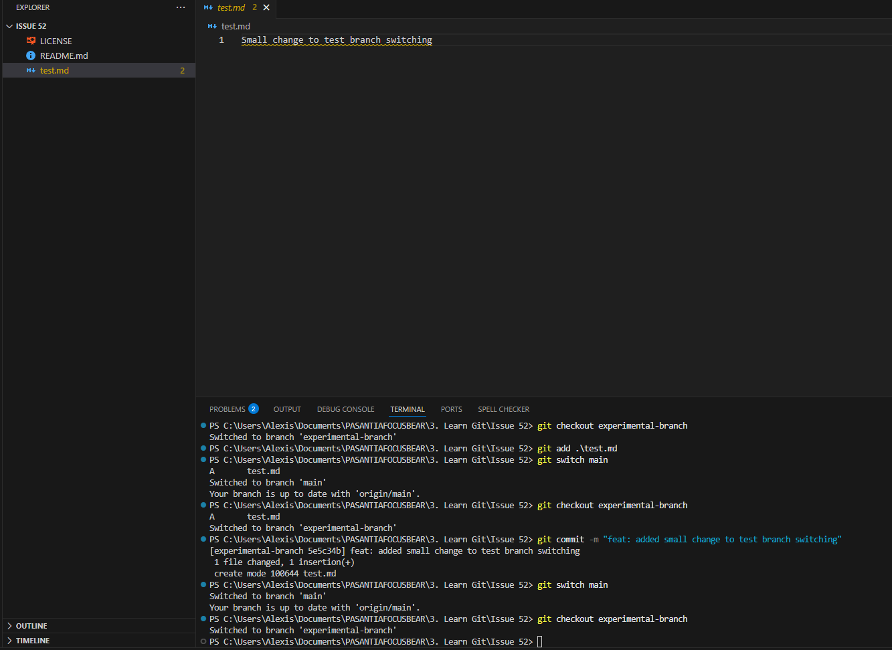
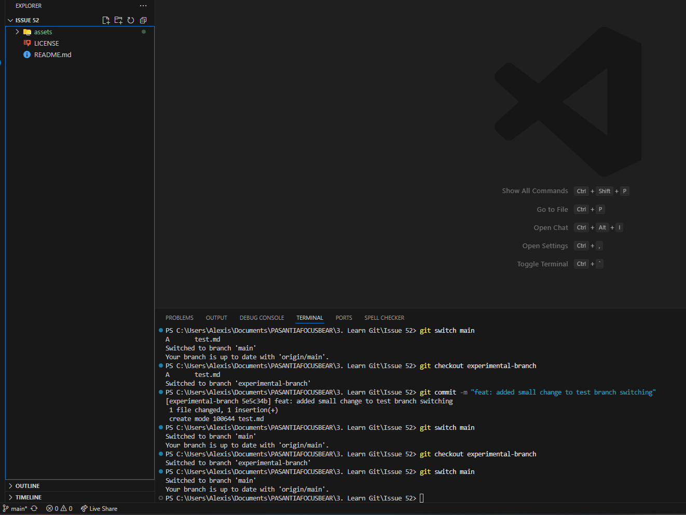

## REFLECTION

### Why is pushing directly to main problematic?

Pushing directly to main is problematic because the most important and critical part of our project is in that branch. If we just add changes to it without revision and approval, we can mess up the project and break the code.

### How do branches help with reviewing code?

Branches are useful because we can work on an additional branch and commit our changes there. Then we can review and test those changes, and if everything is running well, we merge them into the main branch.

### What happens if two people edit the same file on different branches?

When they try to merge the branches, a merge conflict will occur because they edited the same lines in the same file.

## EXPERIMENT

### EXPERIMENTAL BRANCH RESULTS

### MAIN BRANCH RESULTS

