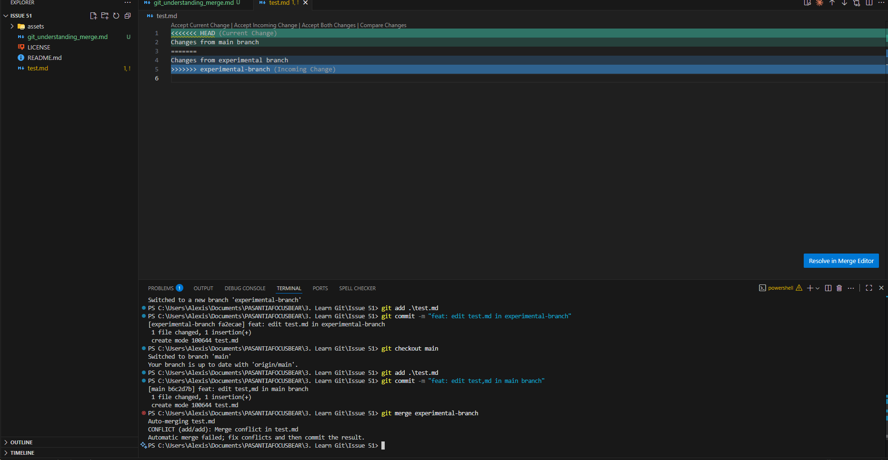
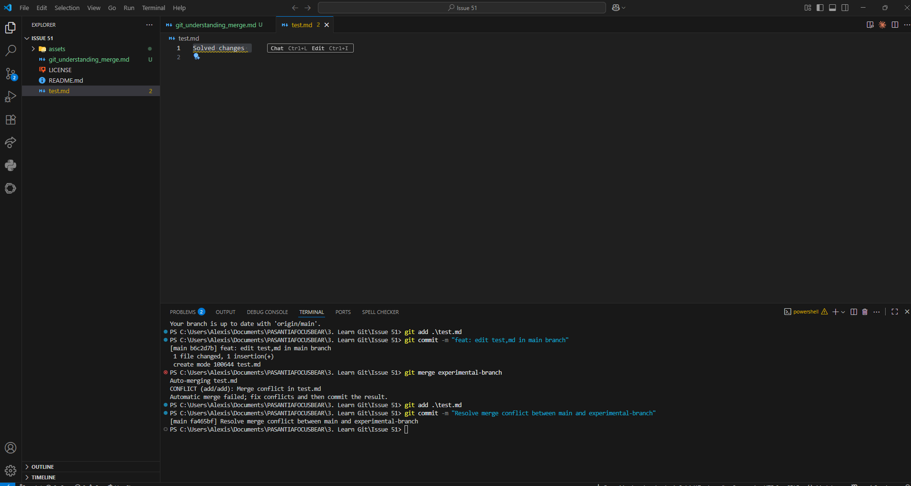

## RESEARCH

### What causes merge conflicts in Git?

A merge conflict is caused when Git can't combine automatically all changes done between two different branches because there are some conflicting changes on the same file and line, so Git gives us the decision of what version will be used definitively.

## REFLECTION

### What caused the conflict?

The conflict was caused because there were some changes on the same line and file, so Git couldn't match them automatically.

### How did you resolve it?

Git asks us in this type of merge conflict, so I just decided the definitive content that will be saved, saved the file, and added it to the corresponding branch.

### What did you learn?

I learned about the importance of verifying our changes properly, and I learned how to solve this type of issue, which is pretty common in real work cases.

## EXPERIMENT

### MERGE CONFLICT

### RESOLVED MERGE CONFLICT

