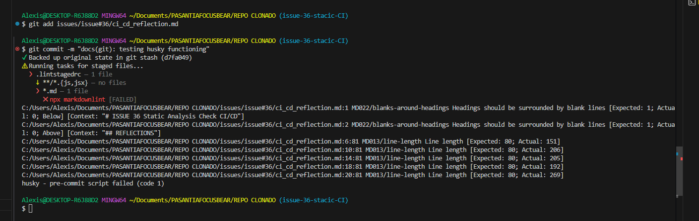
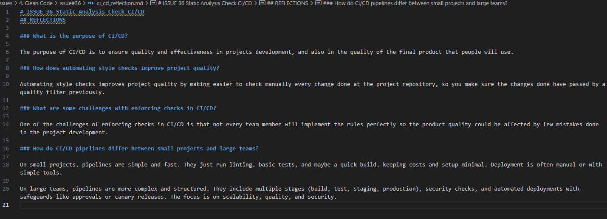
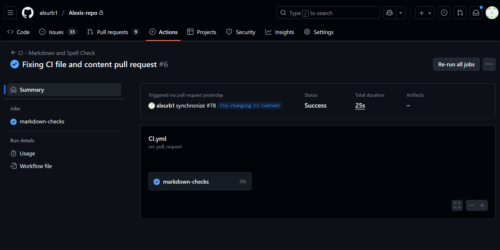
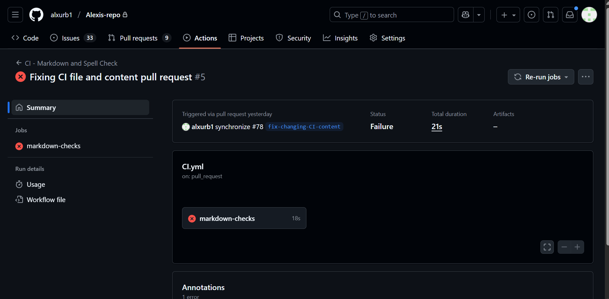

# ISSUE 36 Static Analysis Check CI/CD

## REFLECTIONS

### What is the purpose of CI/CD?

The purpose of CI/CD is to ensure quality and effectiveness in projects development,
and also in the quality of the final product that people will use.

### How does automating style checks improve project quality?

Automating style checks improves project quality by making easier to check manually
every change done at the project repository, so you make sure the changes
done have passed by a quality filter previously.

### What are some challenges with enforcing checks in CI/CD?

One of the challenges of enforcing checks in CI/CD is that not every team member
will implement the rules perfectly so the product quality could be affected by few
mistakes done in the project development.

### How do CI/CD pipelines differ between small projects and large teams?

On small projects, pipelines are simple and fast. They just run linting, basic tests,
and maybe a quick build, keeping costs and setup minimal. Deployment is often manual
or with simple tools.

On large teams, pipelines are more complex and structured. They include multiple
stages, security checks, and automated deployments with safeguards like approvals
or canary releases. The focus is on scalability, quality, and security.

## EXPERIMENT

- **HUSKY USAGE:**

- **MARKDOWN FILE CONTENT:**

- **GITHUB ACTIONS IMPLEMENTATION:**

