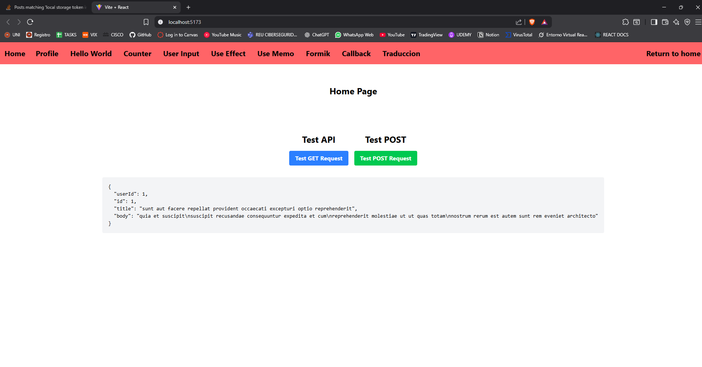
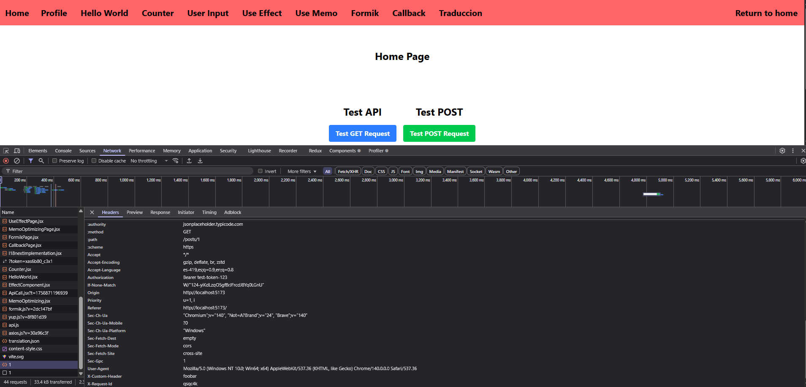
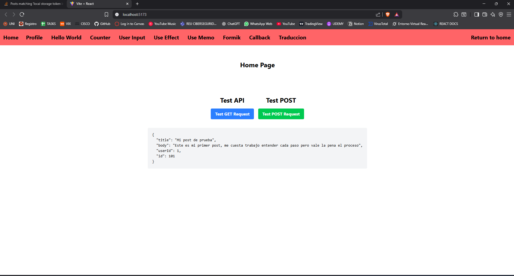
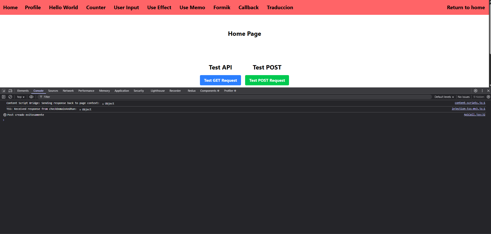

# ISSUE 15 Making API Calls with Axios

## REFLECTION

### Why is it useful to create a reusable Axios instance?

It's useful because it makes the project more scalable, improving code
reusability, we can handle before and after logic of our api client, it's useful
to create an Axios instance because we have centralized our api service.

### How does intercepting requests help with authentication?

It helps with authentication by verifying tokens before the axios instance is
executed, preventing possible future issues, also it's important while getting
the information to our response to notify what did go wrong in order to debug
server or client mistakes.

### What happens if an API request times out, and how can you handle it?

If and API request times out it means that our server takes too long to response
so axios cancels the request and show us a timeout error. We can handle it
adding the amount of time that we want the server to wait with Timeout parameter
on the instance initial configuration and then we can handle the error by
showing a console message.

## AXIOS API REQUEST EVIDENCE

