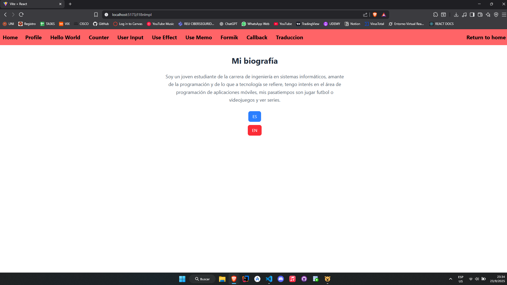
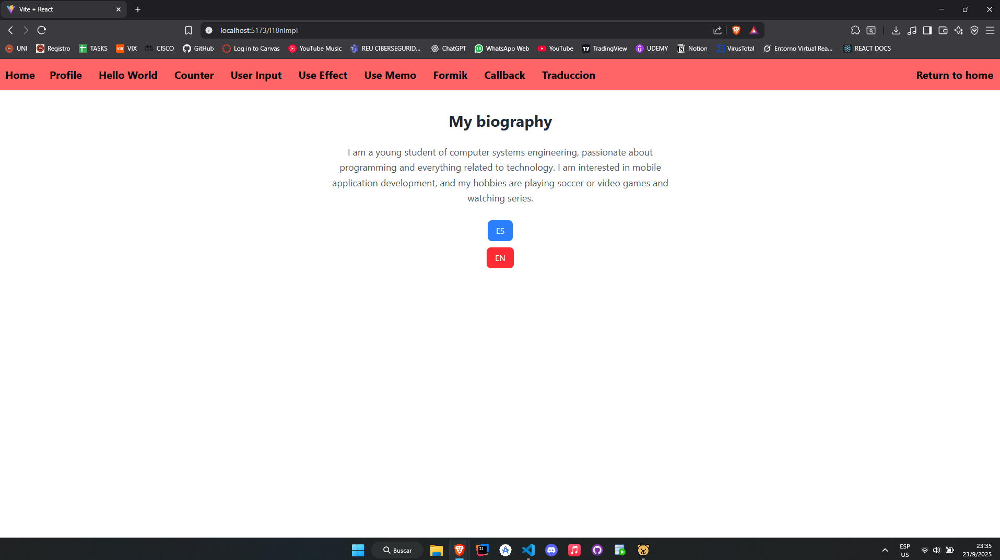

# ISSUE 20 Implementing Internationalization with i18next

## REFLECTIONS

### What challenges did you face while setting up i18next?

I faced some configuration issues in the i18n.js file, but I investigated and
finally set up the dependency properly. Also, during the implementation I
struggled with the syntax and how to properly use the tool, especially with the
.json files for translations.

### Why is it important to use a library instead of manually translations?

It's important because you can have a specific customized version of an app in
one language, and then easily add more languages. i18next is a great tool in
this case because it speeds up the process of managing multiple languages
through a logical code structure.

### How would you handle dynamic content in a multilingual app?

I would use i18next by adding all the languages in the "locales" folder, with a
.json file containing the specific version of the app content for each language.

## I18next use evidence and implementation

