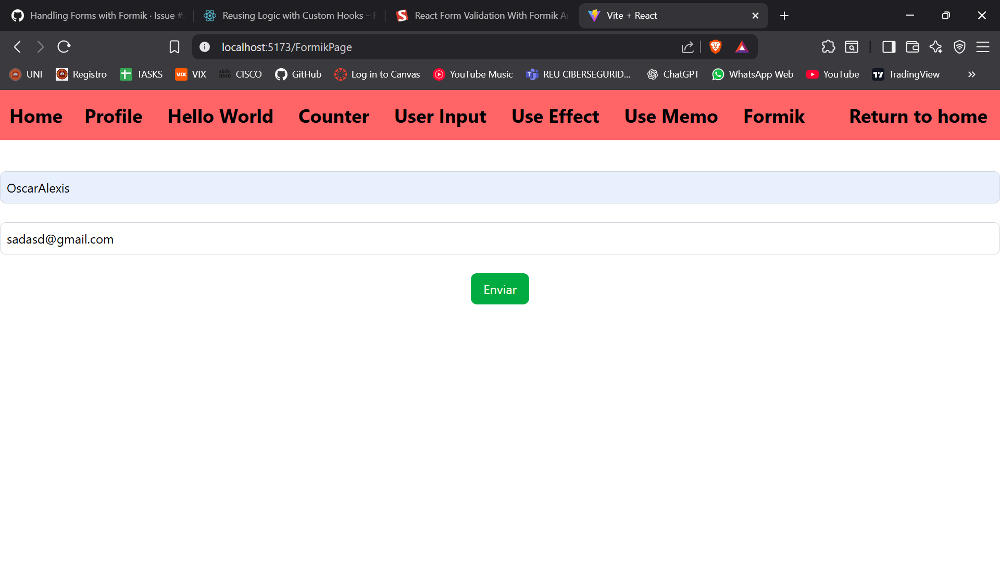
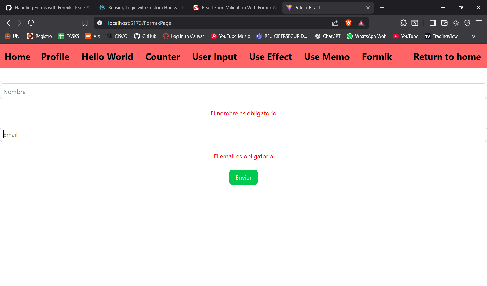
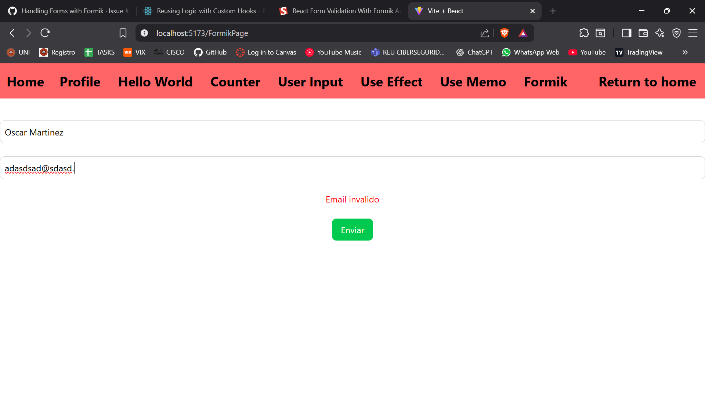

# ISSUE 21 HANDLING FORMS WITH FORMIK

## REFLECTIONS

### How Formik simplify form management compared to handling state manually?

Formik simplifies form management by reducing the amount of code needed,
writing less code while obtaining the same results, improving system
efficiency, and making things easier for the programmer.

### What are the benefits of using Formik's validation over custom logic?

Some of the benefits of using Formik's validation are fewer lines of code for
the programmer, and since it’s integrated into Formik, it helps avoid possible
mistakes compared to writing validation manually. All of these benefits
combined improve code scalability for future modifications.

## HANDLING FORMS WITH FORMIK EVIDENCE

