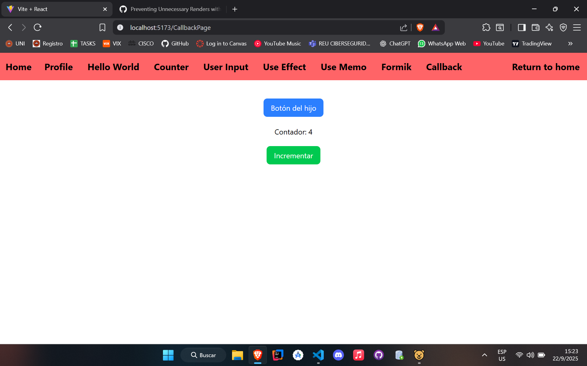
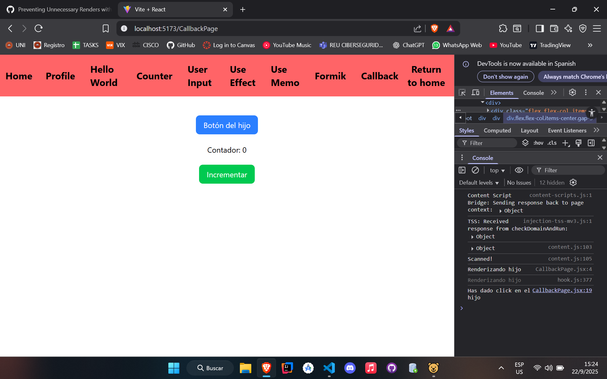

# ISSUE 22 Preventing Unnecessary Renders

## REFLECTIONS

### What problems does useCallback solve?

The useCallback hook helps avoid unnecessary re-renders, especially when
passing functions as props to child components. Normally, functions are
recreated every time a component renders, but with useCallback React keeps
the same function reference as long as the dependencies don’t change. It takes
two arguments: the function itself and an array of dependencies, and returns
a memoized version of that function.

### How does useCallback work differently from useMemo?

The main difference between useCallback and useMemo functioning is that useMemo
memoize values while useCallback memoize hole functions not only the result of
one, as useMemo does.

### When should useCallback not be useful?

The useCallback hook is not convenient to use when the functions is to large
and not cheap or easy for the code performance to execute, for example on my
example the function was an easy piece of code, but when it's a big function,
is not convenient to use useCallback.

## useCallback implementation evidence

