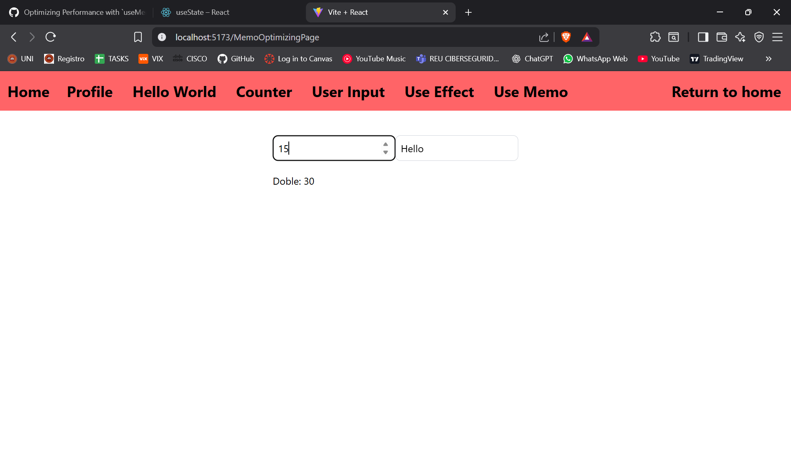

# ISSUE #23

## REFLECTION

### How does useMemo improve performance?

useMemo improves performance by optimizing resources, preventing the entire
code-base from re-rendering when a random component changes its content.
useMemo only refreshes a specific value or calculation when its dependencies
change.

### When should you avoid using useMemo?

We should avoid using useMemo when the calculation is simple, cheap, or when
we actually want the content to refresh on every render. But if we don't need
this, useMemo just adds unnecessary complexity.

### What happens if you remove useMemo from your implementation?

Since my implementation is very short and only meant to review the usage of
useMemo in a real environment, there is no noticeable change in performance.
However, in larger or more complex calculations, not using useMemo could cause
performance issues.

## REACT HOOK IMPLEMENTATION

