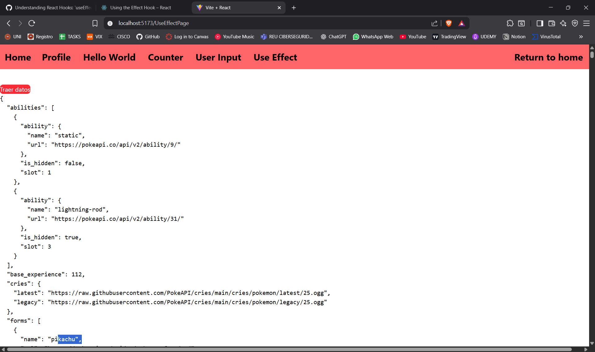

# ISSUE 24 UNDERSTANDING REACT HOOKS: useEffect

## REFLECTION

### When should you use useEffect instead of handling logic inside event handlers?

We should use useEffect instead of event handlers when a piece of code has
to run by itself, without the need of users directly interacting with a
component. A button, for example, could be a good example of handling logic
using event handlers because it directly interacts and exists due to the user.

### What happens if you don’t provide a dependency array?

If I don't provide a dependency array it will cause a lot of problems,
first if I change an state that introduce a render i will have an
infinite loop, this will cause a bad performance of our code,
making it harder to maintain and to handle it later.

### How can improper use of useEffect cause performance issues?

As mentioned before, improper use of useEffect could cause poor performance
in our code by creating infinite loops. This will increase CPU, memory, and
overall resource consumption, which is not good for the code.

## useEffect Implementation

