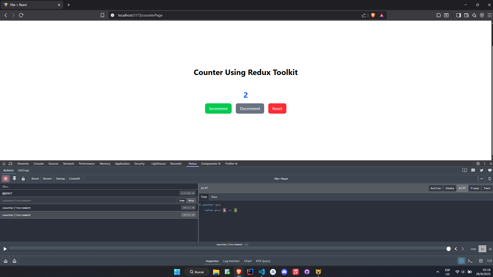

# ISSUE 27 Introduction to Redux Toolkit

## REFLECTIONS

### When should you use Redux instead of useState?

We should use Redux instead of useState when the variables will be used on
external components, and the state is global and constant, of course it's
convenient to use Redux to access Redux debugging tool (Redux DevTools) and use
every advantage that this debugging tool give us.

## REDUX IMPLEMENTATION EVIDENCE

