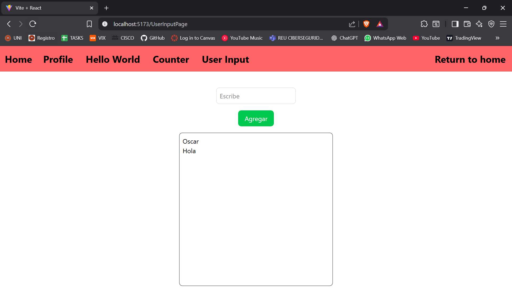

# ISSUE 28 WORKING WITH LISTS AND USER INPUT

## REFLECTION

### What are some common issues when working with lists in React?

Some common issues when working with lists include not using a key on the list
elements, specifying which element of a specific array will be modified, and
forgetting to initialize the hook state as an array. This last one happened
to me, and I had to investigate to solve it.

## LISTS AND USER INPUT APPLICATION

