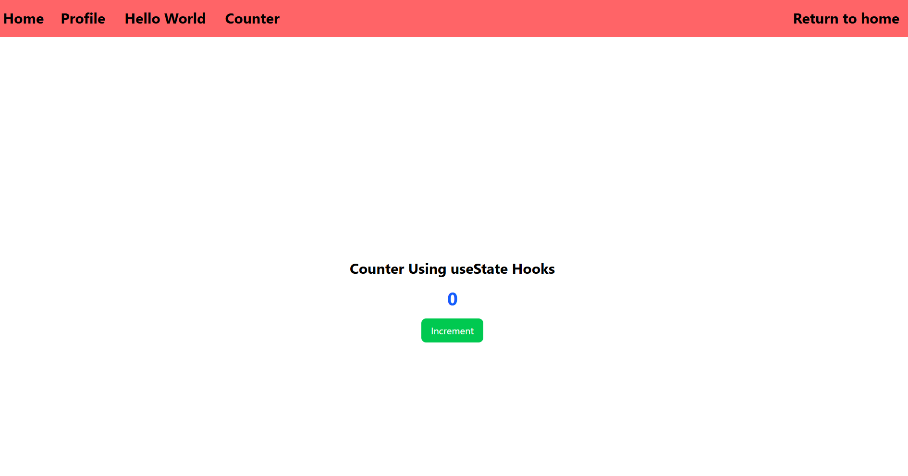
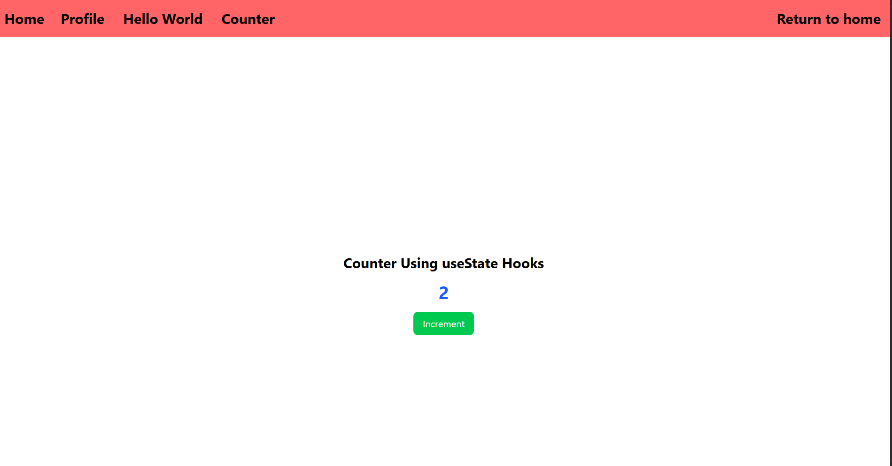

# ISSUE 30 Handling State and User Input

## REFLECTION

### What happens if we modify state directly instead of using "setState"?

If we modify state directly instead of using setState, if we change a specific
value directly the memory value will change, but the user interface won't
reflect that change. This will lead to many bugs in the codebase and fewer
chances to scale our project.

## USE STATE IMPLEMENTATION

