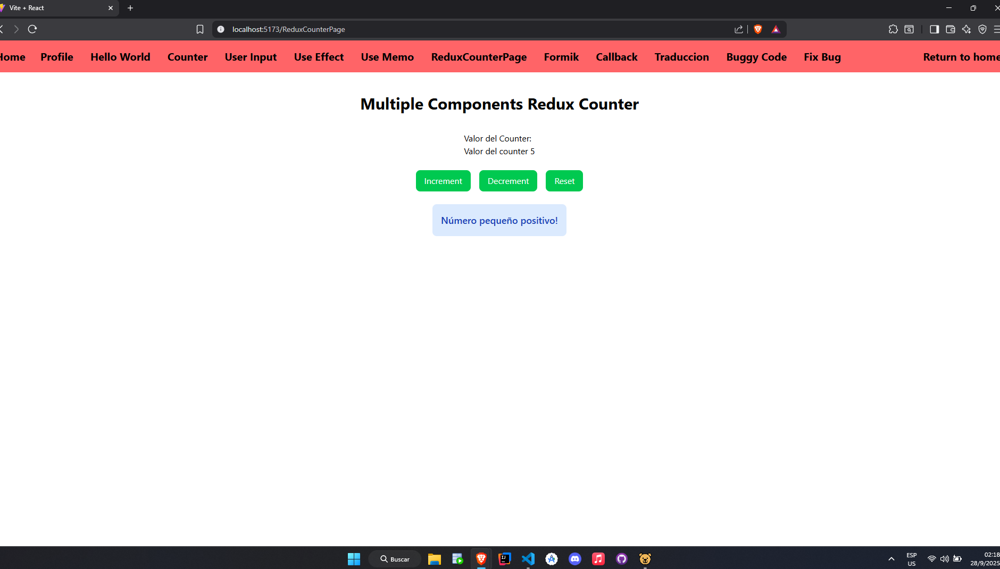

# ISSUE 26 Using Selectors in Redux Toolkit

## REFLECTIONS

### What are the benefits of using selectors instead of directly accessing state?

For me the benefits are that with only one code line every component subscribed
to the slice will receive and actualization of what it's going on around him,
like with this example used to represent the example when a counter component
change it's value depending on external changes.

## Selectors Implementation

