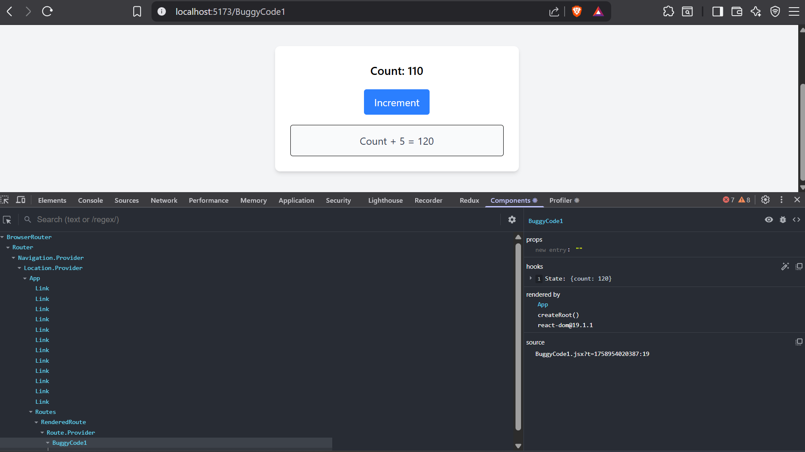
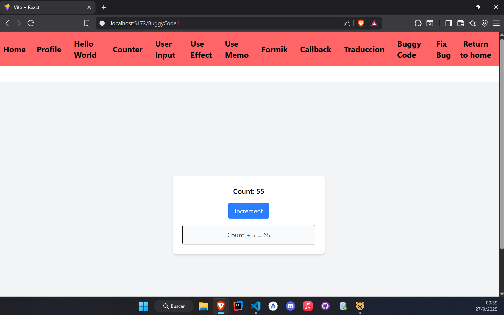
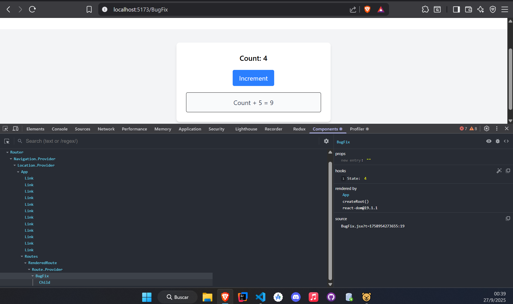
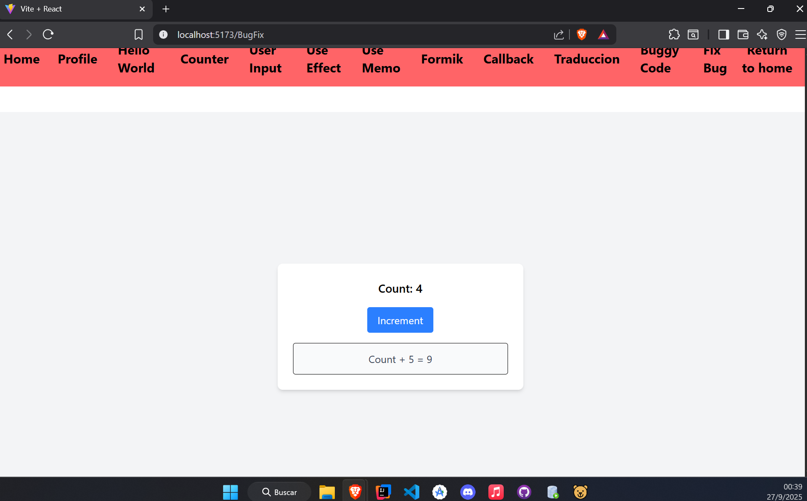

# ISSUE 33 Practice React Debugging in a Test Repo

## REFLECTIONS

### What was the issue?

The issue was that useState was defined as an object, and when the child
component tried to reassign a value to that object, the parent value changed
too, so the real purpose of the simulated function was frustrated due to those
technical issues.

### What debugging method did you use?

I reviewed the code step by step and noticed that the child component was
mutating the state object directly. Understanding React’s principle of
immutability helped me identify the issue.

### How did you resolve the problem?

I resolved the problem by changing the initial useState definition from an
object to an integer. The issue was that objects in JavaScript are passed by
reference, so when the child component reassigned a value, the parent’s state
was also mutated. Integers, on the other hand, are primitive values passed by
copy, so reassigning them doesn’t affect the original value. This ensures state
immutability.

## DEBUGGING THE ISSUE EVIDENCE

