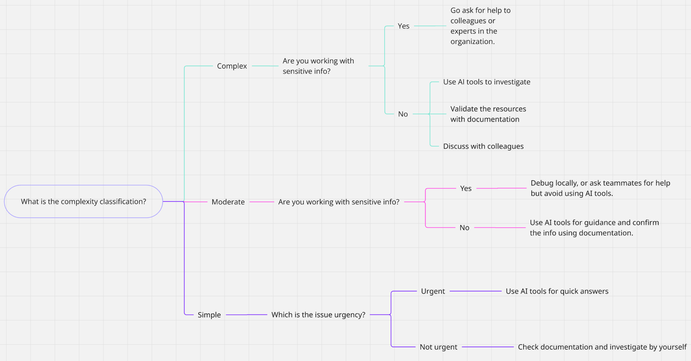

# ISSUE 34 When you get stuck - what next?

## REFLECTIONS

### When do you prefer using AI vs. searching Google?

Well, I prefer to use AI as a searcher, like when I want to find resources for a
specific task. I ask an AI tool, and then I always read the article by myself.
Let's say that I replace Google search with any AI tool, and when I've already
understood the article or what I wanted to learn, I start discussing it with the
AI tool to let me know if I understood the topic.

### How do you decide when to ask a colleague instead?

For example, when I know that a colleague has experience with some tool or
implementation, I would rather ask them first for advice or recommendations.
Then, if I manage to solve the issue with the advice given, I finish the task;
if not, I use other tools depending on what type of information I'm working
with.

### What challenges do developers face when troubleshooting alone?

Many developers face frustration while troubleshooting a problem alone because
sometimes work stress just doesn't let us see the code or workflow from a
different perspective, like if we were working with a teammate or in a
workgroup.

## DECISION TREE

