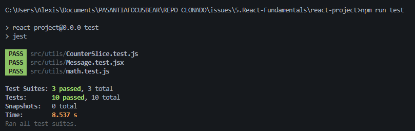

# ISSUE 16 Testing Redux with Jest

## REFLECTIONS

### What was the most challenging part of testing Redux?

The most challenging part for me was testing async Redux actions. Unlike normal
Redux reducers or synchronous actions, async actions involve additional steps
such as mocking API calls or handling promises.

### How do Redux tests differ from React component tests?

Redux tests are different from React component tests because they focus more on
the logic of the global state rather than the UI. For example, when testing
Redux I usually work with reducers, actions, or thunks to make sure state
changes happen correctly. On the other hand, React component tests focus on how
the user interacts with the component, like rendering, clicking, or typing, and
then checking the DOM for the expected results.

## REDUX USAGE EVIDENCE

