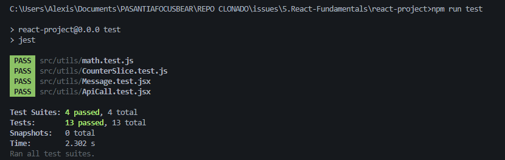

# ISSUE 17 Mocking API Calls in Jest

## REFLECTION

### Why is it important to mock API calls in tests?

It’s important because I don’t want my tests depending on a real API or internet
connection. Mocking makes the tests faster, more reliable, and I can control the
responses to focus only on what I want to check in my code.

### What are some common pitfalls when testing asynchronous code?

One common issue is forgetting to wait for the async code to finish, is the most
common issue when the test finishes before the async function so it generates
false positives, another common pitfall is to handle incorrect timeouts without
considering slower machine performance and handle short failure timeouts.

## Mocking API implementation evidence

