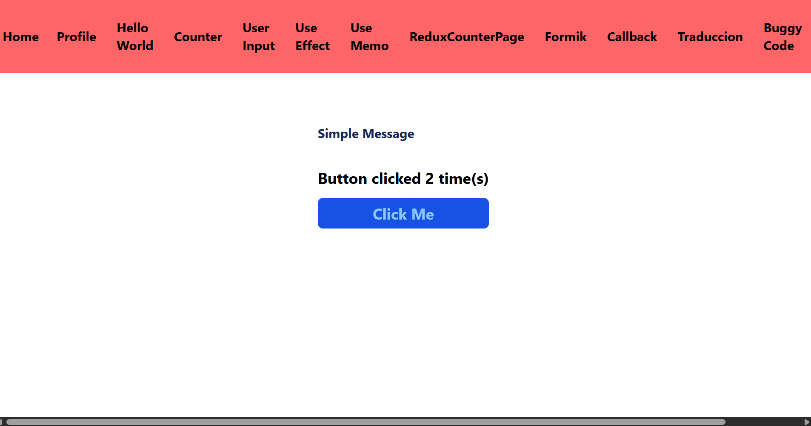
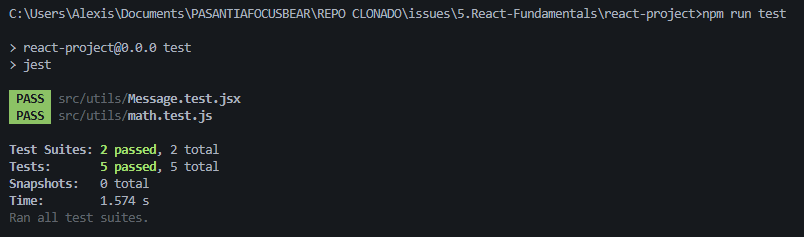

# ISSUE 18 Testing React Components with Jest & React Testing Library

## REFLECTION

### Mention the benefits of using RTL over implementation detail testing

The main benefit is that we can simulate user interactions directly with our
components or functionality, making the tests more accurate and realistic. This
approach helps ensure the app has fewer issues or bugs in real-world usage.

### What challenges did you encounter when simulating user interaction?

One challenge for me was memorizing the test syntax with Jest, since it is
something new. However, I was able to understand the flow of a test and how we
can interact with or simulate user actions using React Testing Library.

## REACT TESTING LIBRARY RESULTS

