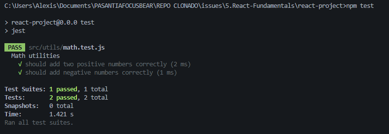

# ISSUE 19 Introduction to Unit Testing with Jest

## REFLECTION

### Why is automated testing important in software development?

For me automated testing is important in software development because it ensures
consistent validation of functionality, reduces the risk of introducing bugs
when making changes, and accelerates the development process by eliminating
repetitive manual testing. This leads to more reliable software and greater
confidence in the codebase.

### What did you find challenging when writing your first Jest test?

I found challenging when writing my first Jest test because I was not
familiarized with the syntax but investigating a little bit I managed to write
properly a simple unit test with Jest on a simple JS function.

## TEST RESULTS

